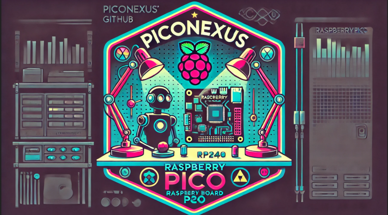

# PicoNexus

Hey there! Welcome to **PicoNexus** – your go-to place for all things Raspberry Pi Pico! We're all about sharing and collaborating on awesome open-source projects using the Raspberry Pi Pico microcontroller.

## About PicoNexus

The Raspberry Pi Pico, powered by the RP2040 microcontroller, is a super versatile and affordable platform. Whether you're a beginner just getting started or an expert pushing the boundaries, you'll find endless possibilities here. At PicoNexus, we aim to build a friendly and vibrant community where we can share cool projects, learn from each other, and grow the Raspberry Pi Pico ecosystem together.

## Central Repository: pico-projects

Our main hangout spot is the [pico-projects](https://github.com/PicoNexus/pico-projects) repository. Here’s what you’ll find:

- **Sample Code:** Tons of examples and snippets to kickstart your Pico journey.
- **Libraries:** Handy libraries to make your projects easier and more powerful.
- **Full Projects:** Complete open-source projects that show off what the Pico can do.
- **Tutorials and Guides:** Easy-to-follow tutorials and guides to help you master the Pico.

We're committed to collecting all the best code for the Raspberry Pi Pico, making it easier for you to find top-notch resources in one place.

## Getting Started

Ready to dive in? Just clone the [pico-projects](https://github.com/PicoNexus/pico-projects) repository and follow the instructions. If you're new to the Raspberry Pi Pico, check out our beginner guides and sample code in the repo. You'll be up and running in no time!

## Reporting issues

[Use this link to report any issue](https://github.com/PicoNexus/.github/issues)

## Contributing

We love contributions! Got a new project, a helpful library, or some improvements to existing code? Fork the [pico-projects](https://github.com/PicoNexus/pico-projects) repository and send us a pull request. For more details on how to contribute, see our [CONTRIBUTING.md](https://github.com/PicoNexus/pico-projects/blob/main/CONTRIBUTING.md).

## License

Everything you find here is open-source and licensed under the [Apache License 2.0](https://github.com/PicoNexus/pico-projects/blob/main/LICENSE).

---

Thanks for stopping by PicoNexus. Let's create something amazing with the Raspberry Pi Pico!

Happy coding!

